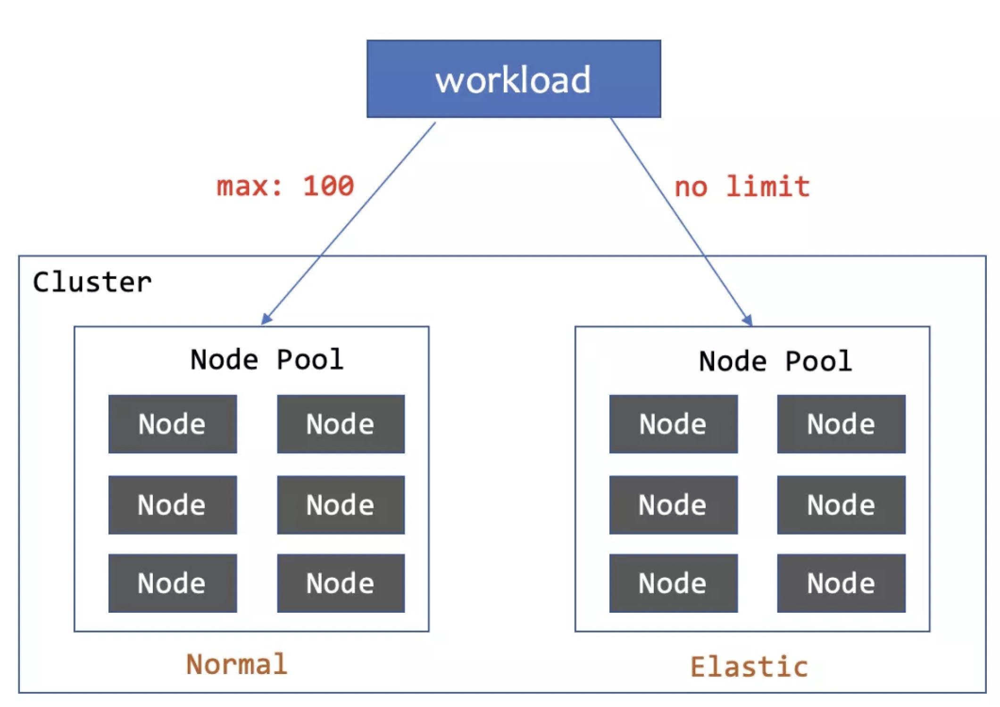
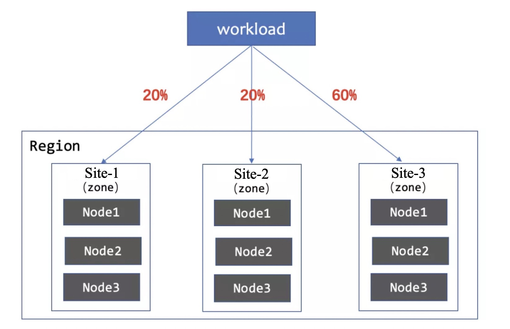
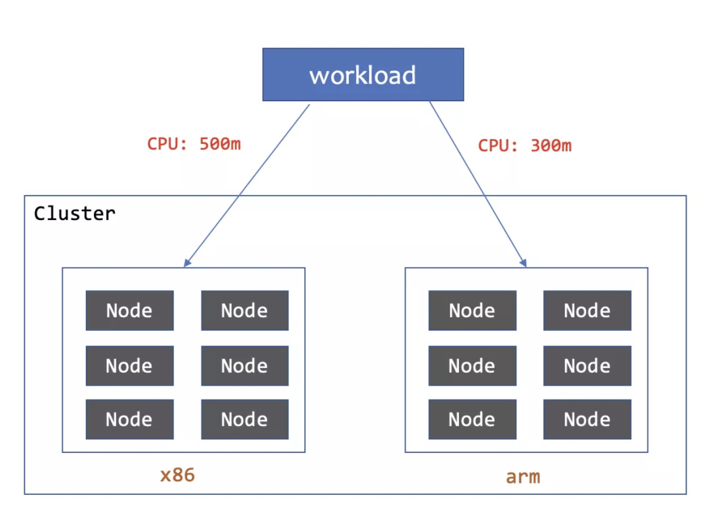

## 背景

Workload分布在不同zone，不同的硬件类型，甚至是不同的集群和云厂商已经是一个非常普遍的需求。过去一般只能将一个应用拆分为多个 workload（比如 Deployment）来部署，由SRE团队手工管理或者对PaaS 层深度定制，来支持对一个应用多个 workload 的精细化管理。

进一步来说，在应用部署的场景下有着多种多样的拓扑打散以及弹性的诉求。其中最常见就是按某种或多种拓扑维度打散，比如：
- 应用部署需要按 node 维度打散，避免堆叠（提高容灾能力）。
- 应用部署需要按 AZ（available zone）维度打散（提高容灾能力）。
- 按 zone 打散时，需要指定在不同 zone 中部署的比例数。

随着云原生在国内外的迅速普及落地，应用对于弹性的需求也越来越多。各公有云厂商陆续推出了Serverless容器服务来支撑弹性部署场景，如阿里云的弹性容器服务ECI，AWS的Fragate容器服务等。以ECI为例，ECI可以通过Virtual Kubelet对接Kubernetes系统，给予Pod一定的配置就可以调度到virtual-node背后的ECI集群。总结一些常见的弹性诉求，比如：
- 应用优先部署到自有集群，资源不足时再部署到弹性集群。缩容时，优先从弹性节点缩容以节省成本。
- 用户自己规划基础节点池和弹性节点池。应用部署时需要固定数量或比例的 Pod 部署在基础节点池，其余的都扩到弹性节点池。

针对这些需求，OpenKruise在 v0.10.0 版本中新增了 WorkloadSpread 特性。目前它支持配合 Deployment、ReplicaSet、CloneSet 这些 workload ，来管理它们下属 Pod 的分区部署与弹性伸缩。下文会深入介绍WorkloadSpread的应用场景和实现原理，帮助用户更好的了解该特性。

---

## WorkloadSpread 介绍

详细细节可以参考[官方文档](https://openkruise.io/docs/user-manuals/workloadspread)。

简而言之，WorkloadSpread能够将workload所属的Pod按一定规则分布到不同类型的Node节点上，能够同时满足上述的打散与弹性场景。

--- 

## 现有方案对比

简单对比一些社区已有的方案。

### Pod Topology Spread Constrains
[Pod topology spread constraints](https://kubernetes.io/docs/concepts/workloads/pods/pod-topology-spread-constraints/) 是Kubernetes社区提供的方案，可以定义按 topology key 的水平打散。用户在定义完后，调度器会依据配置选择符合分布条件的node。

由于PodTopologySpread更多的是均匀打散，无法支持自定义的分区数量以及比例配置，且缩容时会破坏分布。WorkloadSpread可以自定义各个分区的数量，并且管理着缩容的顺序。因此在一些场景下可以避免PodTopologySpread的不足。

#### UnitedDeployment
[UnitedDeployment](https://openkruise.io/docs/user-manuals/uniteddeployment) 是Kruise社区提供的方案，通过创建和管理多个 workload 管理多个区域下的 Pod。

UnitedDeployment非常好的支持了打散与弹性的需求，不过它是一个全新的workload，用户的使用和迁移成本会比较高。而WorkloadSpread是一种轻量化的方案，只需要简单的配置并关联到workload即可。

--- 

## 应用场景
下面我会列举一些WorkloadSpread的应用场景，给出对应的配置，帮助大家快速了解WorkloadSpread的能力。

### 1. 基础节点池至多部署100个副本，剩余的部署到弹性节点池。



```yaml
subsets:
- name: subset-normal
  maxReplicas: 100
  requiredNodeSelectorTerm:
    matchExpressions:
    - key: app.deploy/zone
      operator: In
      values:
      - normal
- name: subset-elastic #副本数量不限
  requiredNodeSelectorTerm:
    matchExpressions:
    - key: app.deploy/zone
      operator: In
      values:
      - elastic
```

当workload少于100副本时，全部部署到normal节点池，超过100个部署到elastic节点池。缩容时会优先删除elastic节点上的Pod。

由于WorkloadSpread不侵入workload，只是限制住了workload的分布，我们还可以通过结合HPA根据资源负载动态调整副本数，这样当业务高峰时会自动调度到elastic节点上去，业务低峰时会优先释放elastic节点池上的资源。

### 2. 优先部署到基础节点池，资源不足再部署到弹性资源池。


```yaml
scheduleStrategy:
  type: Adaptive
  adaptive:
    rescheduleCriticalSeconds: 30
    disableSimulationSchedule: false
subsets:
- name: subset-normal #副本数量不限
  requiredNodeSelectorTerm:
    matchExpressions:
    - key: app.deploy/zone
      operator: In
      values:
      - normal
- name: subset-elastic #副本数量不限
  requiredNodeSelectorTerm:
    matchExpressions:
    - key: app.deploy/zone
      operator: In
      values:
      - elastic
```

两个subset都没有副本数量限制，且启用Adptive调度策略的模拟调度和Reschedule能力。部署效果是优先部署到normal节点池，normal资源不足时，webhook会通过模拟调度选择elastic节点。当normal节点池中的Pod处于pending状态超过30s阈值, WorkloadSpread controller会删除该Pod以触发重建，新的Pod会被调度到elastic节点池。缩容时还是优先缩容elastic节点上的Pod，为用户节省成本。

### 3. 打散到3个zone，比例分别为1:1:3



```yaml
subsets:
- name: subset-a
  maxReplicas: 20%
  requiredNodeSelectorTerm:
    matchExpressions:
    - key: topology.kubernetes.io/zone
      operator: In
      values:
      - zone-a
- name: subset-b
  maxReplicas: 20%
  requiredNodeSelectorTerm:
    matchExpressions:
    - key: topology.kubernetes.io/zone
      operator: In
      values:
      - zone-b
- name: subset-c
  maxReplicas: 60%
  requiredNodeSelectorTerm:
    matchExpressions:
    - key: topology.kubernetes.io/zone
      operator: In
      values:
      - zone-c      
```

按照不同zone的实际情况，将workload按照1:1:3的比例打散。WorkloadSpread会确保workload扩缩容时按照定义的比例分布。

### 4. workload在不同CPU Arch上配置不同的资源配额
workload分布的Node可能有不同的硬件配置，CPU架构等，这就可能需要为不同的subset分别制定Pod配置。这些配置可以是label和annotation等元数据也可以是Pod内部容器的资源配额，环境变量等。



```yaml
subsets:
- name: subset-x86-arch
  # maxReplicas...
  # requiredNodeSelectorTerm...
  patch:
    metadata:
      labels:
        resource.cpu/arch: x86
    spec: 
      containers:
      - name: main
        resources:
          limits:
            cpu: "500m"
            memory: "800Mi"
- name: subset-arm-arch
  # maxReplicas...
  # requiredNodeSelectorTerm...
  patch:
    metadata:
      labels:
        resource.cpu/arch: arm
    spec: 
      containers:
      - name: main
        resources:
          limits:
            cpu: "300m"
            memory: "600Mi"
```

从上面的样例中我们为两个subset的Pod分别patch了不同的label, container resources，方便我们对Pod做更精细化的管理。当workload的Pod分布在不同的CPU架构的节点上，配置不同的资源配额以更好的利用硬件资源。

---

## 实现原理
WorkloadSpread是一个纯旁路的弹性/拓扑管控方案。用户只需要针对自己的 Deployment/CloneSet/Job 对象创建对应的 WorkloadSpread 即可，无需对 workload 做改动，也不会对用户使用 workload 造成额外成本。


### 1. subset优先级与副本数量控制
WorkloadSpread 中定义了多个 subset，每个subset代表一个逻辑域。用户可以自由的根据节点配置，硬件类型，zone等来划分subset。特别的，我们规定了subset的优先级：
1. 按定义从前往后的顺序，优先级从高到低。
2. 优先级越高，越先扩容；优先级越低，越先缩容。

### 2. 如何控制缩容优先级？
理论上，WorkloadSpread 这种旁路方案是无法干涉到 workload 控制器里的缩容顺序逻辑的。

不过，这个问题在近期得以解决—— 经过一代代用户的不懈努力（反馈），k8s 从 1.21 版本开始为 ReplicaSet（Deployment）支持了通过设置 controller.kubernetes.io/pod-deletion-cost 这个 annotation 来指定 Pod 的 “删除代价”：deletion-cost 越高的 Pod，删除的优先级越低。

而 Kruise 从 v0.9.0 版本开始，就在 CloneSet 中支持了 deletion-cost 特性。

因此，WorkloadSpread controller通过调整各个 subset 下属 Pod 的 deletion-cost，来控制workload的缩容顺序。

举个例子：对于以下 WorkloadSpread，以及它关联的 CloneSet 有 10 个副本：
```yaml
  subsets:
  - name: subset-a
    maxReplicas: 8
  - name: subset-b # 副本数量不限
```

则 deletion-cost 数值以及删除顺序为：
- 2 个在 subset-b上的 Pod，deletion-cost 为 100（优先缩容） 
- 8 个在 subset-a上的 Pod，deletion-cost 为 200（最后缩容） 

然后，如果用户修改了 WorkloadSpread 为：
```yaml
  subsets:
  - name: subset-a
    maxReplicas: 5 # 8-3, 
  - name: subset-b
```

则 workloadspread controller 会将其中 3 个在 susbet-a 上 Pod 的 deletion-cost值由 200 改为 -100，则:
- 3 个在 subset-a 上的 Pod，deletion-cost 为 -100（优先缩容） 
- 2 个在 subset-b 上的 Pod，deletion-cost 为 100（其次缩容） 
- 5 个在 subset-a 上的 Pod，deletion-cost 为 200（最后缩容） 

这样就能够优先缩容那些超过subset副本限制的Pod了，当然总体还是按照subset定义的顺序从后向前缩容。

### 3. 数量控制

如何确保 webhook 严格按照 subset 优先级顺序、maxReplicas 数量来注入Pod 规则是 WorkloadSpread 实现层面的重点难题。

#### 3.1 解决并发一致性问题
在 workloadspread的status 中有对应每个 subset 的 status，其中 missingReplicas 字段表示了这个 subset 需要的 Pod 数量，-1 表示没有数量限制（subset 没有配置 maxReplicas）。
```yaml
spec:
  subsets:
  - name: subset-a
    maxReplicas: 1
  - name: subset-b
  # ...
status:
  subsetStatuses:
  - name: subset-a
    missingReplicas: 1
  - name: subset-b
    missingReplicas: -1
  # ...
```

当 webhook 收到 Pod create请求时：
1. 根据 subsetStatuses 顺序依次找 missingReplicas 大于 0 或为 -1 的 suitable subset。
2. 找到suitable subset后，如果 missingReplicas 大于 0，则先减 1 并尝试更新 workloadspread status。
3. 如果更新成功，则将该 subset定义的规则注入到 pod 中。
4. 如果更新失败，则重新 get 这个 workloadspread以获取最新的status，并回到步骤 1（有一定重试次数限制）。

同样，当 webhook 收到 Pod delete/eviction 请求时，则将 missingReplicas 加 1 并更新。

毫无疑问，我们在使用乐观锁来解决更新冲突。但是仅使用乐观锁是不合适的，因为workload在创建Pod时会并行创建大量的Pod，apiserver会在一瞬间发送很多Pod create请求到webhook，并行处理会产生非常多的冲突。大家都知道，冲突太多就不适合使用乐观锁了，因为它解决冲突的重试成本非常高。为此我们还加入了workloadspread级别的互斥锁，将并行处理限制为串行处理。加入互斥锁还有新的问题，即当前groutine获取锁后，极有可能从infromer中拿的workloadspread不是最新的，还是会冲突。所以groutine在更新完workloadspread之后，先将最新的workloadspread对象缓存起来再释放锁，这样新的groutine获取锁后就可以直接从缓存中拿到最新的workloadspread。当然，多个webhook的情况下还是需要结合乐观锁机制来解决冲突。

#### 3.2 解决数据一致性问题
那么，missingReplicas 数值是否交由 webhook 控制即可呢？答案是不行，因为：
1. webhook 收到的 Pod create 请求，最终不一定真的能成功（比如 Pod 不合法，或在后续 quota 等校验环节失败了）。
2. webhook 收到的 Pod delete/eviction 请求，最终也不一定真的能成功（比如后续被 PDB、PUB 等拦截了）。
3. K8s 里总有种种的可能性，导致 Pod 没有经过 webhook 就结束或没了（比如 phase 进入 Succeeded/Failed，或是 etcd 数据丢了等等）。
4. 同时，这也不符合面向终态的设计理念。

因此，workloadspread status 是由 webhook 与 controller 协作来控制的：
- webhook 在 Pod create/delete/eviction 请求链路拦截，修改 missingReplicas 数值。
- 同时 controller 的 reconcile 中也会拿到当前 workload 下的所有 Pod，根据 subset 分类，并将 missingReplicas 更新为当前实际缺少的数量。
- 从上面的分析中，controller从informer中获取Pod很可能存在延时，所以我们还在status中增加了creatingPods map, webook注入的时候会记录key为pod.name, value为时间戳的一条entry到map，controller再结合map维护真实的missingReplicas。同理还有一个deletingPods map来记录Pod的delete/eviction事件。

### 4. 自适应调度能力
在 WorkloadSpread 中支持配置 scheduleStrategy。默认情况下，type 为 Fixed，即固定按照各个 subset 的前后顺序、maxReplicas 限制来将 Pod 调度到对应的 subset 中。
但真实的场景下，很多时候 subset 分区或拓扑的资源，不一定能完全满足 maxReplicas 数量。用户需要按照实际的资源情况，来为 Pod 选择有资源的分区扩容。这就需要用 Adaptive 这种自适应的调度分配。

WorkloadSpread 提供的 Adaptive 能力，逻辑上分为两种：
1. SimulationSchedule：在 Kruise webhook 中根据 informer 里已有的 nodes/pods 数据，组装出调度账本，对 Pod 进行模拟调度。即通过 nodeSelector/affinity、tolerations、以及基本的 resources 资源，做一次简单的过滤。（对于 vk 这种节点不太适用）
2. Reschedule：在将 Pod 调度到一个 subset 后，如果调度失败超过 rescheduleCriticalSeconds 时间，则将该 subset 暂时标记为 unschedulable，并删除 Pod 触发重建。默认情况下，unschedulable 会保留 5min，即在 5min 内的 Pod 创建会跳过这个 subset。

--- 

## 小结
WorkloadSpread通过结合一些kubernetes现有的特性以一种旁路的形式赋予workload弹性部署与多域部署的能力。我们希望用户通过使用WorkloadSpread降低workload部署复杂度，利用其弹性伸缩能力切实降低成本。
目前阿里云内部正在积极的落地，落地过程中的调整会及时反馈社区。未来WorkloadSpread还有一些新能力计划，比如让WorkloadSpread支持workload的存量Pod接管，支持批量的workload约束，甚至是跨过workload层级使用label来匹配Pod。其中一些能力需要实际考量社区用户的需求场景。希望大家多多参与到Kruise社区，多提issue和pr，帮助用户解决更多云原生部署方面的难题，构建一个更好的社区。

---

## 参考文献
- WorkloadSpread: https://openkruise.io/docs/user-manuals/workloadspread
- Pod Topology Spread Constrains: https://kubernetes.io/docs/concepts/workloads/pods/pod-topology-spread-constraints/
- UnitedDeployment: https:/
                           