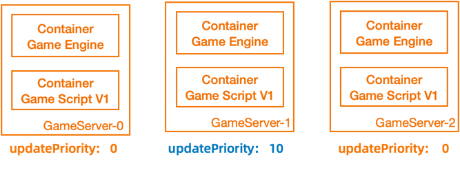

# 游戏服更新策略
## 功能概述

OKG 提供了原地升级（[热更新](./hot-update.md)）、批量更新、按优先级更新等多种更新策略。

用户可设置GameServer的更新优先级，配合partition参数，实现在实际生产场景下，把控更新范围、更新顺序、更新节奏。
如下图所示，提高序号为1的游戏服优先级，同时设置partition为2，则会优先更新1号游戏服；随后更改partition为0，则会再更新其余游戏服。详情可参考使用示例。



## 使用示例

本示例中将一组游戏服分成两批次更新，模拟灰度更新，逐步验证的场景。

此时GameServerSet下有3个游戏服副本：
```shell
kubectl get gs
NAME        STATE      OPSSTATE   DP    UP
gs-demo-0   Ready      None       0     0
gs-demo-1   Ready      None       0     0
gs-demo-2   Ready      None       0     0
```

设置更新优先级，将1号游戏服优先级调大：
```shell
kubectl edit gs gs-demo-1

...
spec:
  deletionPriority: 0
  opsState: None
  updatePriority: 10 #初始为0，调大成10
...
```

接下来设置 GameServerSet partition、以及即将更新的新镜像：
```shell
kubectl edit gss gs-demo

...
        image: gameserver:latest # 更新镜像
        name: gameserver
...
  updateStrategy:
    rollingUpdate:
      maxUnavailable: 5
      partition: 2 # 设置保留的游戏服数目，这里只更新一个，所以要保留余下2个
      podUpdatePolicy: InPlaceIfPossible
...

```

此时只有gs-demo-1将会更新:
```shell
kubectl get gs
NAME        STATE      OPSSTATE   DP    UP
gs-demo-0   Ready      None       0     0
gs-demo-1   Updating   None       0     10
gs-demo-2   Ready      None       0     0


# 一段时间过后
...

kubectl get gs
NAME        STATE      OPSSTATE   DP    UP
gs-demo-0   Ready      None       0     0
gs-demo-1   Ready      None       0     10
gs-demo-2   Ready      None       0     0
```

待gs-demo-1验证通过后，更新其余游戏服：
```shell
kubectl edit gss gs-demo
...
  updateStrategy:
    rollingUpdate:
      maxUnavailable: 5
      partition: 0 # 设置保留的游戏服数目，将其设置为0，更新余下全部
      podUpdatePolicy: InPlaceIfPossible
...

```

